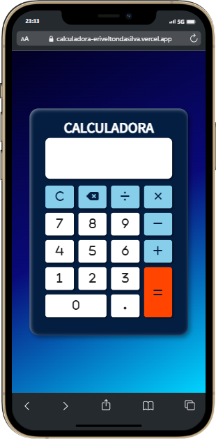

<h1># Calculadora.js</h1>

Este projeto foi feito para pôr em prática os meus conhecimentos em javascript no processo de aprendizagem dessa linguagem. Também pratiquei flexbox e grid do css para fazer o layout do app.

<h3>Tecnologias usadas:</h3>
<ul>
  <li>HTML5</li>
  <li>CSS3</li>
  <li>SASS</li>
  <li>SMACSS</li>
  <li>JavaScript</li>
</ul>

<h3>Deploy:</h3>

  <a href="https://calculadora-eriveltondasilva.vercel.app/">Clique aqui</a>
  para ver este projeto em funcionamento.

